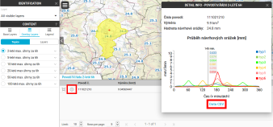

Úvod
====

O projektu
----------

Cílem projektu je zpracování **návrhových krátkodobých dešťů** pro
potřeby **hydrologického či erozního modelování** v kontextu
navrhování typických opatření na podporu retence a akumulace vod v
povodí. Více o projektu na http://rain.fsv.cvut.cz.

Cílem je také výsledky promítnou do metodiky a veřejnosti umožnit
přístup k výsledkům formou map, `webových služeb a mapové aplikace
<http://rain.fsv.cvut.cz/webapp/>`__ pro získání návrhových scénářů
krátkodobých srážek.

Webová mapová platforma
-----------------------

V rámci projektu je provozována webová platforma Gisquick určená pro
snadnou tvorbu mapové aplikace v prostředí Internetu, viz `webové
stránky projektu Rain <http://rain.fsv.cvut.cz/webapp/gisquick/>`__.

.. note:: Gisquick je open source projekt publikovaný pod licencí GNU
   GPL, více informací najdete na http://gisquick.org.

Pro účely prezentace výsledků projektu byla vytvořena **ukázková
webové mapová aplikace** prezentující vrstvu povodí IV. řádu s
vyčíslenými úhrny návrhových srážek s délkou srážky 6 hodin. Aplikace
je dostupná na adrese
https://rain1.fsv.cvut.cz:4433/?PROJECT=rain%2Fwebapp. Vstup do
aplikace je umožněn i bez přihlašovacích údajů uživateli *Guest*.

.. figure:: img/gisquick-guest.svg

   Vstup do ukázkové webové aplikace jako uživatel Guest.

Po načtení aplikace zvolíme téma (Topic) z nabízených vrstev povodí IV. řádu s vyčíslenými úhrny srážek délky 6 hod a dobou opakování 2 roky, 5, 10, 20, 50 nebo 100 let.

.. figure:: img/gisquick-topics.svg

   Volba tématu s dobou opakování 2 roky.

Aplikace umožňuje pro zvolené povodí IV. řádu zobrazit podrobnější
informace, zejména typické časové průběhy návrhové srážky.

.. figure:: img/gisquick-identify.svg

   Nejprve aktivujeme nástroj identify.

S aktivním nástrojem identify přiblížíme pohled na zájmové povodí a klikneme do jeho
plochy. Ve spodní části obrazovky se objeví popisné údaje související s tímto
povodím včetně úhrnu šestihodinové návrhové srážky v mm pro danou dobu
opakování. 

   Panel zobrazující detailní informace k danému povodí IV. řádu.

Aktivujeme ikonku *Info* v panelu s detailními informacemi (druhá ikonka v řádku záznamu). Tím je vyvolán v pravé části obrazovky info panel s podrobnými informacemi o návrhové srážce, konkrétně grafická reprezentace šesti typických průběhů návrhové srážky. Zobrazené hodnoty vyjadřují pětiminutové úhrny v milimetrech (mm/5min).

.. tip:: Podrobné informace o uživatelském rozhraní webové mapové
   aplikace Gisquick najdete v jeho `dokumentaci
   <http://gisquick.readthedocs.io/en/latest/user-interface.html>`__.

Další kapitoly této dokumentace popisují postup vytvoření nové webové
mapové aplikace s využitím vlastních dat a parametrů návrhových
srážek.

