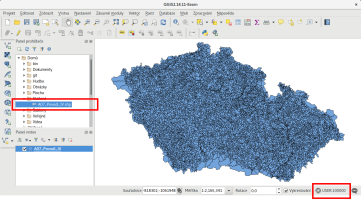
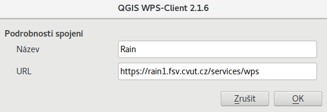
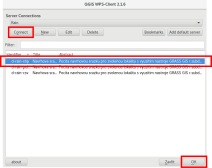
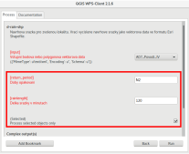
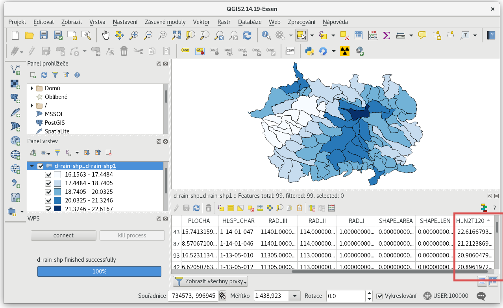
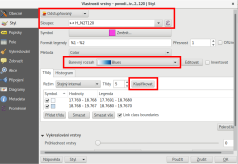
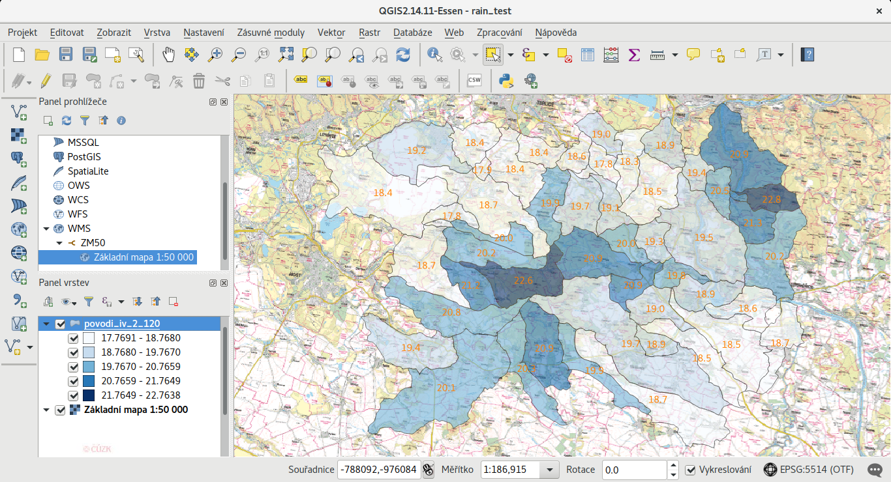

Příprava projektu
=================

V této části dokumentace si popíšeme jakým způsobem připravit naše
geografická data pro publikaci, a vypočítat pro ně návrhové srážky se
zvolenou dobou opakování a délkou srážky.

.. important:: Pro přípravu dat je nutné použít GIS nástroj `QGIS
   <http://qgis.org>`__. **QGIS** je open source software volně dostupný
   pro různé operační systémy včetně MS Windows. `Stáhněte aktuální
   verzi <http://qgis.org/en/site/forusers/download.html>`__ tohoto
   softwaru a nainstalujte na Váš počítač.
	       
V rámci naší ukázky použijeme vektorovou vrstvu povodí IV. řádu
veřejně dostupnou z databáze Dibavod (`odkaz ke stažení dat
<http://www.dibavod.cz/download.php?id_souboru=1418>`__ ve formátu
Esri Shapefile). Na disku vytvoříme nový adresář kam data stáhneme a
rozbalíme.

.. note:: Namísto vrstvy povodí IV. řádu můžete přirozeně použít svoje
   vlastní data. Pro výpočet návrhové srážky jsou ale podstatné dvě
   věci. Vstupní vrstva musí být bodová nebo polygonová. Velikost
   souboru se vstupními daty musí být **menší než 10MB**.
	  
Spustíme program QGIS a načteme vrstvu povodí IV. řádu.

   Soubor s povodím IV. řádu najdeme v Panelu prohlížeče a do mapového
   okna přidáme tažením myši (Drag-And-Drop).

.. important:: U případě dat v souřadnicovém systému S-JTSK se může
   stát, že jej QGIS nekorektně identifikuje (v našem případě jako
   uživatelský souřadnicový systém 100000). Tento problém je třeba
   opravit, jinak *nebude možné projekt publikovat*! Souřadnicový systém
   nastavíme v dialogu vlastnostech vrstvy (:menuselection:`Vrstva -->
   Vlastnosti`). V případě S-JTSK použijeme EPSG kód 5514.

   .. figure:: img/qgis-vector-props.svg
   
   Zároveň nastavíme stejný souřadnicový systém i pro mapové okno, viz
   obr. níže.

   .. figure:: img/qgis-statusbar-srs.svg

      Změna souřadnicového systému mapového okna z
      uživatelského (100000) na S-JTSK (5514).

Pro účel demonstrace celého postupu publikace vybereme pouze několik
málo povodí. Aktivujeme nástroj pro výběr prvků (viz obr. níže) a
tažením myši definujeme obdélník pro výběr. Vybraná povodí budou
zvýrazněna žlutou barvou.

.. figure:: img/qgis-select.svg

   Výběr zájmových povodí pro publikaci.

.. tip:: Více k ovládaní programu QGIS najdete v `online materiálech
   <http://training.gismentors.eu/qgis-zacatecnik/>`__ pro školení
   skupiny GISMentors.

Výpočet úhrnu návrhových srážek
-------------------------------

Pro vybraná povodí vypočítáme úhrny návrhových srážek s danou dobou
opakování a délkou srážky. Využijeme nástroj ``d-rain-shp``
poskytovaný v rámci projektu Rain jako `WPS služba
<http://rain.fsv.cvut.cz/webapp/webove-sluzby/ogc-wps/>`__. Abychom
mohli tento nástroj v programu QGIS použít, je nutné doinstalovat
zásuvný modul WPS klienta. Spustíme dialog pro správu zásuvných modulu
(:menuselection:`Zásuvné moduly --> Spravovat a instalovat zásuvné
moduly`). Do vyhledávacího pole zadáme klíčové slovo "wps" a zvolíme k
instalaci **WPS Client**.

.. figure:: img/qgis-wps-client-install.svg

   Instalace zásuvného modulu WPS klienta.

V levém dolním rohu se objeví dialog WPS klienta. Klikneme na tlačítko
``Connect`` a následujícím dialogu vytvoříme pomocí tlačítka ``New``
nové připojení.

.. figure:: img/qgis-wps-client-connect.svg

   Dialog WPS klienta a přidání nové služby.

Zvolíme název připojení a zadáme URL služby. WPS služba projektu Rain
je dostupná na adrese https://rain1.fsv.cvut.cz/services/wps

   Údaje pro přidání WPS služby.

Poté se ke službě připojíme (tlačítko ``Connect``), zvolíme z nabídky
nástroj ``d-rain-shp`` a otevřeme jeho dialog pomocí tlačítka ``OK``.

   Výběr WPS nástroje ``d-rain-shp`` a jeho otevření.

V následujícím dialogu vyplníme vstupní parametry nástroje:

* ``return_period`` - v našem případě jsme zvolili pouze dobu opakování 2 roky (*N2*)
* ``rainlength`` - délka srážky v min

Podstatné je zaškrtnout **Process selected objects only** tak, aby
výpočet probíhal pouze nad vybranými povodími.

   Volba vstupních parametrů pro výpočet úhrnu návrhové srážky.

Výpočet spustíme tlačítkem ``Run``. Po dokončení výpočtu (délka
výpočtu je závislá na rychlosti připojení k výpočetnímu serveru neboť
WPS klient nejprve posílá vstupní data na výpočetní server a po
dokončení výpočtu výsledná data stahuje ze serveru na stranu klienta,
tj. do programu QGIS) se do mapového okna přidá automaticky i výsledná
vrstva vytvořená nástrojem ``d-rain-shp``.

   Výsledná vrstva vrácená WPS nástrojem s atributovým sloupcem úhrnu
   návrhové srážky (H_N2_T120).
   
Vrstva vytvořená nástrojem ``d-rain-shp`` je *přechodná*, proto účel
publikace je nutné ji uložit na disk. Vytvoříme nový adresář, kam tuto
vrstvu uložíme. Tento adresář bude obsahovat veškerá data určená k
publikaci.

.. figure:: img/qgis-save-as.png
   :width: 75%
   
   Uložení výsledné vrstvy s úhrnem návrhových srážek na disk.

V dialogu pro uložení nové vrstvy zadáme cestu k výstupnímu souboru
(formát ponecháme Esri Shapefile). Je také důležité zkontrolovat
souřadnicový systém vrstvy. Především v případě S-JTSK se může stát,
že QGIS tento souřadnicový systém špatně detekuje. V tomto případe
souřadnicový systém vrstvy nastavíme ručně, v případě S-JTSK jde o
EPSG kód 5514.

.. figure:: img/qgis-save-as-dialog.svg
   :width: 75%
   
   Uložení zájmových povodí IV. řádu včetně vypočítaných úhrnů
   návrhových srážek do nové vrstvy.

Následně nato můžeme původní a přechodnou vrstvu z mapového okna
odstranit. Ponecháme pouze nově uloženou vrstvu v adresáři pro
publikaci.

.. figure:: img/qgis-remove-vector.png
   :width: 50%
		    
   Původní a přechodnou vrstvu odstraníme z mapového okna. V projektu
   ponecháme pouze data zájmového území.

Pohled okna přiblížíme na aktuální vrstvu (:menuselection:`Zobrazit
--> Přiblížit na rozměry okna`). Otevřeme vlastnosti vrstvy
(:menuselection:`Vrstva --> Vlastnosti`) a nastavíme vhodný styl
(záložka ``Style``). V našem případě *Odstupňovaný*, sloupec s
hodnotami návrhových srážek v mm (v našem případě ``H_N2T120``) a
barevný rozsah *Blues*. Barevnou škálu aktivujeme pomocí tlačítka
``Klasifikovat``.

   Nastavení stylu povodí dle úhrnu návrhových srážek.

Dále aktivujeme popisky (záložka ``Popisky``) a nastavíme je na
sloupec s hodnotami návrhových srážek (``H_N2T120``). Formátování
čísel nastavíme na jedno desetinné číslo. Vhodné je též aktivovat pro
popisky pozadí nebo nastavit vhodnou barvu písma. Nastavení potvrdíme
tlačítkem ``OK``.

.. tip:: Jako podkladovou vrstvu lze použít veřejně dostupné WMS
   vrstvy, např. `Základní mapu 1:50 000
   <http://geoportal.cuzk.cz/(S(5tfcubwc4m4ixgnphoebhquz))/Default.aspx?menu=3117&mode=TextMeta&side=wms.verejne&metadataID=CZ-CUZK-WMS-ZM50-P&metadataXSL=metadata.sluzba>`__. Postup
   jak `přidat do projektu WMS vrstvu
   <http://training.gismentors.eu/qgis-zacatecnik/webove_sluzby/rastr.html#pripojeni-wms-sluzby>`__
   naleznete v materiálech skupiny GISMentors. V tomto případě ještě
   nastavíme pro vrstvu povodí vhodnou míru průhlednosti (a to v
   záložce ``Styl``).

Vrstvě můžeme před publikací ještě nastavit vhodný název
(:menuselection:`Vrstva --> Vlastnosti`, záložka ``Obecné``, *Název
vrstvy*).

   Finální podoba projektu před publikací.
   
Projekt uložíme (:menuselection:`Projekt --> Uložit`) do stejného
adresáře jako vektorovou vrstvu s vypočtenými úhrny návrhových srážek.

